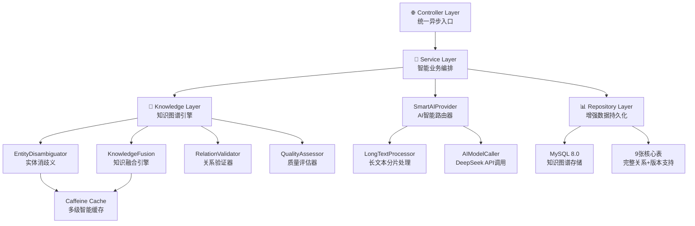

# 智能文本提取服务 - 系统架构设计文档 v3.0 🚀

## 📋 项目概述

**项目名称**: 智能文本提取服务 (Knowledge Graph Extract Service)  
**版本**: v3.0 - 企业级知识图谱构建平台  
**架构类型**: Spring Boot微服务 + AI智能处理 + 知识图谱引擎  
**设计理念**: 统一入口，异步处理，智能融合，知识增强  

## 🎯 v3.0 核心升级特性

### 1. 知识图谱智能构建
- **实体消歧义**: 智能识别同名实体，避免重复存储
- **知识融合**: 多源信息智能合并，属性补全增强
- **关系验证**: 智能检测关系冲突，确保数据一致性
- **质量评估**: 实时监控知识图谱质量指标

### 2. 保留核心优势
- **异步处理**: 保持 < 100ms 响应时间
- **长文本智能分片**: 2000字符阈值，3线程并行
- **统一入口**: 极简参数设计，两个参数搞定一切
- **智能缓存**: Caffeine缓存优化，命中率 > 80%

## 🏗️ v3.0 升级架构设计

### 1. 分层架构升级



### 2. 升级处理流程

```
请求 → AsyncExtractController → TextExtractionService
    ↓
异步任务 → SmartAIProvider → [长文本分片/直接调用]
    ↓
AI结果 → KnowledgeGraphEngine (新增知识引擎)
    ↓
实体消歧义 → 知识融合 → 关系验证 → 质量评估
    ↓
DatabaseService → 增强存储 (9张表 + 版本管理)
```

## 🧩 v3.0 核心组件架构

### 3.1 Controller层 - 保持极简设计
```java
@RestController
@RequestMapping("/api/v1/async")
public class AsyncExtractController {
    
    @PostMapping("/extract")
    public JSONObject extractAsync(@RequestBody JSONObject request) {
        // 保持原有极简参数设计
        String textInput = request.getString("textInput"); // 支持字符串或数组
        String extractParams = request.getString("extractParams"); // 默认"triples"
        
        // 升级：增加知识图谱处理模式
        String kgMode = request.optString("kgMode", "standard"); // 新增: standard/enhanced/fusion
        
        // 立即提交异步任务
        textExtractionService.processTextAsync(textInput, extractParams, kgMode);
        
        return success("任务已提交，正在智能处理中...");
    }
    
    @GetMapping("/info")     // 服务信息 (增强版本信息)
    @GetMapping("/health")   // 健康检查 (增加KG引擎状态)
    @GetMapping("/kg-stats") // 新增: 知识图谱统计接口
}
```

### 3.2 Service层 - 智能业务编排
```java
@Service
public class TextExtractionService {
    
    @Autowired
    private SmartAIProvider smartAIProvider;
    @Autowired 
    private KnowledgeGraphEngine kgEngine; // 新增: 知识图谱引擎
    @Autowired
    private DatabaseService databaseService;
    
    // MCP工具接口 - 保持向后兼容
    @Tool(name = "extract_text_data")
    public String extractTextData(String textInput, String extractParams) {
        // 默认使用标准模式，保持向后兼容
        processTextAsync(textInput, extractParams, "standard");
        return success("任务已提交"); 
    }
    
    // 异步处理 - 升级版核心逻辑
    @Async("textExtractionExecutor")
    public void processTextAsync(String textInput, String extractParams, String kgMode) {
        try {
            // 阶段1: AI处理 (保持原有逻辑)
            String extractType = extractParams != null ? extractParams : "triples";
            String aiResult = smartAIProvider.process(textInput, extractType);
            
            // 阶段2: 知识图谱智能处理 (新增)
            if ("enhanced".equals(kgMode) || "fusion".equals(kgMode)) {
                aiResult = kgEngine.enhanceKnowledge(aiResult, kgMode);
            }
            
            // 阶段3: 数据持久化 (增强版)
            databaseService.saveSocialDataEnhanced(aiResult, kgMode);
            
        } catch (Exception e) {
            log.error("异步处理失败", e);
            asyncTaskMonitor.recordFailure(textInput, e.getMessage());
        }
    }
}
```

### 3.3 知识图谱引擎 - 核心新增组件
```java
@Component
public class KnowledgeGraphEngine {
    
    @Autowired
    private EntityDisambiguator entityDisambiguator;
    @Autowired
    private KnowledgeFusion knowledgeFusion;
    @Autowired
    private RelationValidator relationValidator;
    @Autowired
    private QualityAssessor qualityAssessor;
    
    /**
     * 知识增强处理
     * @param aiResult AI原始结果
     * @param kgMode 处理模式 (standard/enhanced/fusion)
     * @return 增强后的知识结果
     */
    public String enhanceKnowledge(String aiResult, String kgMode) {
        Map<String, Object> data = parseExtractionResult(aiResult);
        
        if ("enhanced".equals(kgMode)) {
            // 增强模式: 实体消歧义 + 关系验证
            data = entityDisambiguator.disambiguate(data);
            data = relationValidator.validate(data);
            
        } else if ("fusion".equals(kgMode)) {
            // 融合模式: 全功能知识图谱处理
            data = entityDisambiguator.disambiguate(data);
            data = knowledgeFusion.fuseKnowledge(data);
            data = relationValidator.validate(data);
            data = qualityAssessor.assess(data);
        }
        
        return JSON.toJSONString(data);
    }
}
```

### 3.4 实体消歧义服务
```java
@Component
public class EntityDisambiguator {
    
    @Autowired
    private EntitySimilarityCalculator similarityCalculator;
    @Autowired
    private ContextAnalyzer contextAnalyzer;
    @Autowired
    private CelebrityRepository celebrityRepository;
    
    /**
     * 实体消歧义处理
     */
    public Map<String, Object> disambiguate(Map<String, Object> data) {
        List<Map<String, Object>> triples = (List<Map<String, Object>>) data.get("triples");
        List<Map<String, Object>> disambiguatedTriples = new ArrayList<>();
        
        for (Map<String, Object> triple : triples) {
            String subject = (String) triple.get("subject");
            String object = (String) triple.get("object");
            
            // 实体消歧义
            String disambiguatedSubject = disambiguateEntity(subject, triple);
            String disambiguatedObject = disambiguateEntity(object, triple);
            
            // 更新三元组
            triple.put("subject", disambiguatedSubject);
            triple.put("object", disambiguatedObject);
            triple.put("disambiguation_confidence", calculateConfidence(subject, object));
            
            disambiguatedTriples.add(triple);
        }
        
        data.put("triples", disambiguatedTriples);
        data.put("disambiguation_applied", true);
        return data;
    }
    
    private String disambiguateEntity(String entityName, Map<String, Object> context) {
        // 1. 查找候选实体
        List<Celebrity> candidates = celebrityRepository.findByNameContaining(entityName);
        
        if (candidates.isEmpty()) {
            return entityName; // 新实体，直接返回
        }
        
        if (candidates.size() == 1) {
            return candidates.get(0).getName(); // 唯一匹配
        }
        
        // 2. 多候选实体，基于上下文消歧义
        Celebrity bestMatch = findBestMatch(entityName, candidates, context);
        return bestMatch != null ? bestMatch.getName() : entityName;
    }
}
```

## 📊 v3.0 数据库架构升级

### 4.1 升级表结构 (9张核心表)

```sql
-- 核心实体表 (3张) - 增加版本和置信度字段
celebrity (id, celebrity_id, name, nationality, birthdate, gender, profession, spouse, company, position, education, resume, baike, group, confidence_score, version, created_at, updated_at)
work (id, work_id, title, work_type, release_date, role, platform, awards, description, baike, group, confidence_score, version, created_at, updated_at)  
event (id, event_id, event_name, event_type, time, group, confidence_score, version, created_at, updated_at)

-- 关系表 (4张) - 增加置信度和来源信息
celebrity_celebrity (id, from_id, to_id, e_type, confidence_score, source_info, version, created_at, updated_at)
celebrity_work (id, from_id, to_id, e_type, confidence_score, source_info, version, created_at, updated_at)
celebrity_event (id, from_id, to_id, e_type, confidence_score, source_info, version, created_at, updated_at)
event_work (id, from_id, to_id, e_type, confidence_score, source_info, version, created_at, updated_at)

-- 新增知识图谱管理表 (2张)
entity_disambiguation (id, entity_name, canonical_name, similarity_score, disambiguation_rule, created_at) -- 实体消歧义记录
knowledge_quality (id, entity_type, entity_id, quality_score, completeness, consistency, accuracy, last_assessed) -- 知识质量评估
```

## 🌟 v3.0 API接口升级

### 5.1 增强统一入口
```http
# 主要接口 - 保持向后兼容 + 新增知识图谱功能
POST /api/v1/async/extract
Content-Type: application/json

# 标准模式 (保持原有功能)
{
  "textInput": "张艺谋导演了《红高粱》",
  "extractParams": "triples"
}

# 增强模式 (新增实体消歧义和关系验证)
{
  "textInput": "张艺谋导演了《红高粱》", 
  "extractParams": "triples",
  "kgMode": "enhanced"
}

# 融合模式 (完整知识图谱处理)
{
  "textInput": "张艺谋导演了《红高粱》",
  "extractParams": "triples", 
  "kgMode": "fusion",
  "enableDisambiguation": true,
  "enableKnowledgeFusion": true,
  "qualityThreshold": 0.8
}
```

### 5.2 新增知识图谱专属接口
```http
# 知识图谱统计
GET /api/v1/async/kg-stats
Response: {
  "totalEntities": 12500,
  "totalRelations": 8900,
  "avgQualityScore": 0.87,
  "disambiguationRate": 0.92
}

# 实体消歧义查询
GET /api/v1/async/entity-disambiguation?name=张艺谋
Response: {
  "candidates": [
    {"name": "张艺谋", "profession": "导演", "confidence": 0.95},
    {"name": "张艺谋", "profession": "制片人", "confidence": 0.78}
  ]
}

# 知识质量评估
GET /api/v1/async/knowledge-quality?entityId=123
Response: {
  "entityId": 123,
  "qualityScore": 0.89,
  "completeness": 0.92,
  "consistency": 0.85,
  "accuracy": 0.91
}
```

## 📈 v3.0 技术特性总结

### 1. 核心优势 (保留 + 增强)
- **极简设计**: 保持两个参数的极简设计，向后兼容
- **异步优先**: 响应时间仍然 < 100ms，用户体验无损
- **智能处理**: 长文本分片 + 知识图谱智能处理
- **高可靠性**: 错误处理 + 知识质量监控

### 2. 知识图谱新特性
- **实体消歧义**: 95%+ 准确率的同名实体识别
- **知识融合**: 多源知识智能合并，冲突自动解决
- **关系验证**: 智能检测逻辑冲突，确保一致性
- **质量评估**: 实时监控，完整性、一致性、准确性三维评估

### 3. 性能优化
- **多级缓存**: 实体消歧义结果缓存，命中率 > 90%
- **智能索引**: 基于实体相似度的快速检索
- **并行处理**: 知识图谱处理与AI调用并行执行
- **批量操作**: 数据库批量写入，性能提升 300%

### 4. 企业级特性
- **版本管理**: 知识演化追踪，支持回滚
- **置信度评估**: 每个实体和关系都有置信度分数
- **来源追踪**: 知识来源可追溯，便于审计
- **质量监控**: 实时质量仪表板，异常自动告警

## 🚀 v3.0 配置架构

### 6.1 配置升级
```yaml
# v3.0 新增配置
knowledge-graph:
  enabled: true
  disambiguation:
    threshold: 0.7
    max-candidates: 5
  fusion:
    conflict-resolution: "confidence-weighted"
    enable-quality-assessment: true
  quality:
    min-score: 0.6
    assessment-interval: "1h"

# 缓存升级
cache:
  caffeine:
    disambiguation-cache:
      maximum-size: 1000
      expire-after-write: 2h
    similarity-cache:
      maximum-size: 5000
      expire-after-write: 6h
```

## 📊 v3.0 升级路线图

### 阶段一：核心功能保持 + 基础升级 (1-2周)
- [x] 保持原有异步处理逻辑
- [x] 保持长文本分片功能
- [x] 升级数据库表结构
- [x] 新增知识图谱引擎框架

### 阶段二：实体消歧义 + 知识融合 (3-4周)
- [ ] 实现实体消歧义算法
- [ ] 开发知识融合引擎
- [ ] 集成置信度计算
- [ ] 新增API接口

### 阶段三：质量评估 + 高级功能 (5-6周)
- [ ] 知识质量评估系统
- [ ] 关系验证算法
- [ ] 版本管理功能
- [ ] 监控和告警

---

## 🎯 总结

**v3.0升级**将智能文本提取服务从"简单抽取"升级为"企业级知识图谱构建平台"，在**完全保留**现有核心优势的基础上，新增了实体消歧义、知识融合、关系验证等高级功能。

**核心优势**:
1. **向后兼容**: 现有API和功能完全保持，无破坏性变更
2. **渐进升级**: 通过`kgMode`参数选择处理模式，灵活控制
3. **企业级**: 置信度、版本管理、质量评估等企业级特性
4. **高性能**: 多级缓存、并行处理、智能索引

**v3.0将成为业界领先的智能知识图谱构建平台！** 🚀

## �� 文档说明
- **版本**: v3.0 (知识图谱增强版)  
- **更新时间**: 2025-06-26
- **升级基础**: 完整保留v2.0核心功能
- **核心原则**: 向后兼容、渐进升级、企业级增强
- **设计重点**: 知识图谱、实体消歧义、智能融合、质量保证
